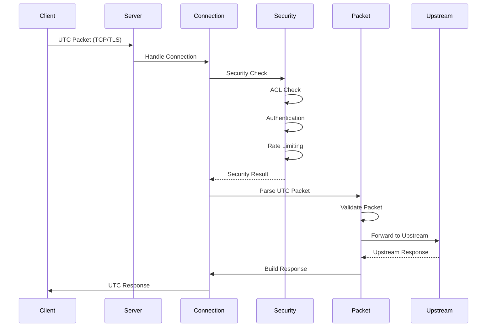

# Simple UTC Daemon - Architecture Diagrams

## System Architecture

```mermaid
graph TB
    subgraph "Application Layer"
        Main[main.cpp]
        Server[UTCServer]
    end
    
    subgraph "Core Layer"
        Connection[UTCConnection<br/>Client Connection]
        Packet[UTCPacket<br/>Packet Processing]
    end
    
    subgraph "Security Layer"
        ACL[ACL Manager<br/>Access Control]
        Auth[Auth Manager<br/>Authentication]
        RateLimit[Rate Limiter<br/>DoS Protection]
        DDoSProtection[DDoS Protection<br/>Attack Mitigation]
        CertACL[Certificate ACL<br/>TLS Certificate Control]
        TLSManager[TLS Manager<br/>TLS/SSL]
    end
    
    subgraph "Network Layer"
        AsyncIO[Async I/O<br/>Asynchronous Operations]
        UpstreamMgr[Upstream Manager<br/>Upstream Connections]
    end
    
    subgraph "Configuration Layer"
        Config[UTCConfig<br/>Configuration]
    end
    
    subgraph "Utilities"
        Logger[Logger<br/>Logging]
        Metrics[Metrics<br/>Performance Metrics]
        HealthCheck[HealthCheck<br/>Health Monitoring]
        ErrorHandler[ErrorHandler<br/>Error Management]
        BackupRestore[Backup/Restore<br/>Data Management]
        Watchdog[Watchdog<br/>Process Monitoring]
    end
    
    Main --> Server
    Server --> Connection
    Server --> Packet
    Server --> ACL
    Server --> Auth
    Server --> RateLimit
    Server --> DDoSProtection
    Server --> CertACL
    Server --> TLSManager
    Server --> AsyncIO
    Server --> UpstreamMgr
    Server --> Config
    Server --> Logger
    Server --> Metrics
    Server --> HealthCheck
    Server --> ErrorHandler
    Server --> BackupRestore
    Server --> Watchdog
    
    Connection --> Packet
    Connection --> TLSManager
```

## UTC Packet Processing Flow

```mermaid
sequenceDiagram
    participant Client
    participant Server
    participant Connection
    participant Security
    participant Packet
    participant Upstream
    
    Client->>Server: UTC Packet (TCP/TLS)
    Server->>Connection: Handle Connection
    Connection->>Security: Security Check
    Security->>Security: ACL Check
    Security->>Security: Authentication
    Security->>Security: Rate Limiting
    Security-->>Connection: Security Result
    Connection->>Packet: Parse UTC Packet
    Packet->>Packet: Validate Packet
    Packet->>Upstream: Forward to Upstream
    Upstream-->>Packet: Upstream Response
    Packet->>Connection: Build Response
    Connection->>Client: UTC Response
```

