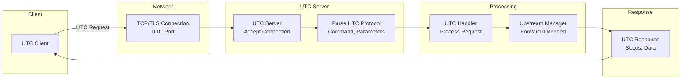

# Simple UTC Daemon - Data Flow Diagrams

## UTC Request Data Flow

```mermaid
flowchart LR
    subgraph "Client"
        C1[UTC Client]
    end

    subgraph "Network"
        N1[TCP/TLS Connection<br/>UTC Port]
    end

    subgraph "UTC Server"
        US1[UTC Server<br/>Accept Connection]
        US2[Parse UTC Protocol<br/>Command, Parameters]
    end

    subgraph "Processing"
        P1[UTC Handler<br/>Process Request]
        P2[Upstream Manager<br/>Forward if Needed]
    end

    subgraph "Response"
        R1[UTC Response<br/>Status, Data]
    end

    C1 -->|UTC Request| N1
    N1 --> US1
    US1 --> US2
    US2 --> P1
    P1 --> P2
    P2 --> R1
    R1 --> C1
```
