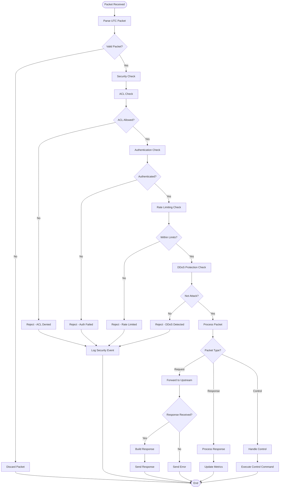
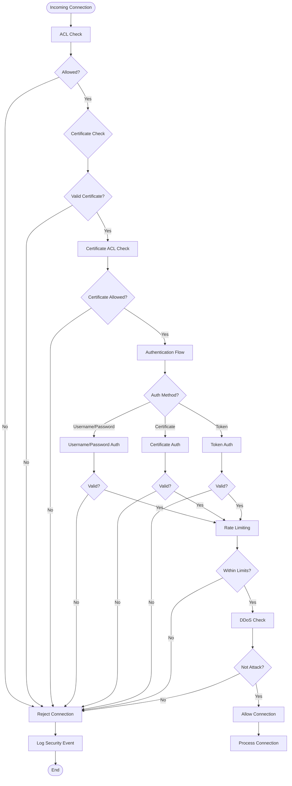

# Simple UTC Daemon - Flow Diagrams

## UTC Packet Processing Flow

```mermaid
flowchart TD
    Start([Packet Received]) --> Parse[Parse UTC Packet]
    Parse --> Validate{Valid Packet?}
    Validate -->|No| Discard[Discard Packet]
    Validate -->|Yes| SecurityCheck[Security Check]
    
    SecurityCheck --> ACLCheck[ACL Check]
    ACLCheck --> ACLOK{ACL Allowed?}
    ACLOK -->|No| RejectACL[Reject - ACL Denied]
    ACLOK -->|Yes| AuthCheck[Authentication Check]
    
    AuthCheck --> AuthOK{Authenticated?}
    AuthOK -->|No| RejectAuth[Reject - Auth Failed]
    AuthOK -->|Yes| RateLimitCheck[Rate Limiting Check]
    
    RateLimitCheck --> RateOK{Within Limits?}
    RateOK -->|No| RejectRate[Reject - Rate Limited]
    RateOK -->|Yes| DDoSCheck[DDoS Protection Check]
    
    DDoSCheck --> DDoSOK{Not Attack?}
    DDoSOK -->|No| RejectDDoS[Reject - DDoS Detected]
    DDoSOK -->|Yes| ProcessPacket[Process Packet]
    
    ProcessPacket --> CheckType{Packet Type?}
    CheckType -->|Request| ForwardUpstream[Forward to Upstream]
    CheckType -->|Response| ProcessResponse[Process Response]
    CheckType -->|Control| HandleControl[Handle Control]
    
    ForwardUpstream --> UpstreamResponse{Response Received?}
    UpstreamResponse -->|Yes| BuildResponse[Build Response]
    UpstreamResponse -->|No| SendError[Send Error]
    
    ProcessResponse --> UpdateMetrics[Update Metrics]
    HandleControl --> ExecuteControl[Execute Control Command]
    BuildResponse --> SendResponse[Send Response]
    
    Discard --> End([End])
    RejectACL --> LogSecurity[Log Security Event]
    RejectAuth --> LogSecurity
    RejectRate --> LogSecurity
    RejectDDoS --> LogSecurity
    SendError --> End
    SendResponse --> End
    UpdateMetrics --> End
    ExecuteControl --> End
    LogSecurity --> End
```

## Security Processing Flow

```mermaid
flowchart TD
    Start([Incoming Connection]) --> CheckACL[ACL Check]
    CheckACL --> ACLAllowed{Allowed?}
    ACLAllowed -->|No| Reject[Reject Connection]
    ACLAllowed -->|Yes| CheckCert{Certificate Check}
    
    CheckCert --> CertValid{Valid Certificate?}
    CertValid -->|No| Reject
    CertValid -->|Yes| CheckCertACL[Certificate ACL Check]
    CheckCertACL --> CertACLOK{Certificate Allowed?}
    CertACLOK -->|No| Reject
    CertACLOK -->|Yes| AuthFlow[Authentication Flow]
    
    AuthFlow --> AuthMethod{Auth Method?}
    AuthMethod -->|Username/Password| UserPassAuth[Username/Password Auth]
    AuthMethod -->|Certificate| CertAuth[Certificate Auth]
    AuthMethod -->|Token| TokenAuth[Token Auth]
    
    UserPassAuth --> UserPassOK{Valid?}
    CertAuth --> CertAuthOK{Valid?}
    TokenAuth --> TokenAuthOK{Valid?}
    
    UserPassOK -->|No| Reject
    UserPassOK -->|Yes| RateLimit[Rate Limiting]
    CertAuthOK -->|No| Reject
    CertAuthOK -->|Yes| RateLimit
    TokenAuthOK -->|No| Reject
    TokenAuthOK -->|Yes| RateLimit
    
    RateLimit --> RateOK{Within Limits?}
    RateOK -->|No| Reject
    RateOK -->|Yes| DDoSCheck[DDoS Check]
    
    DDoSCheck --> DDoSOK{Not Attack?}
    DDoSOK -->|No| Reject
    DDoSOK -->|Yes| Allow[Allow Connection]
    
    Reject --> LogSecurity[Log Security Event]
    Allow --> Process[Process Connection]
    LogSecurity --> End([End])
```

