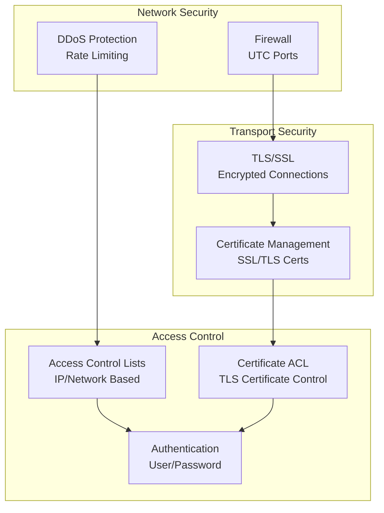
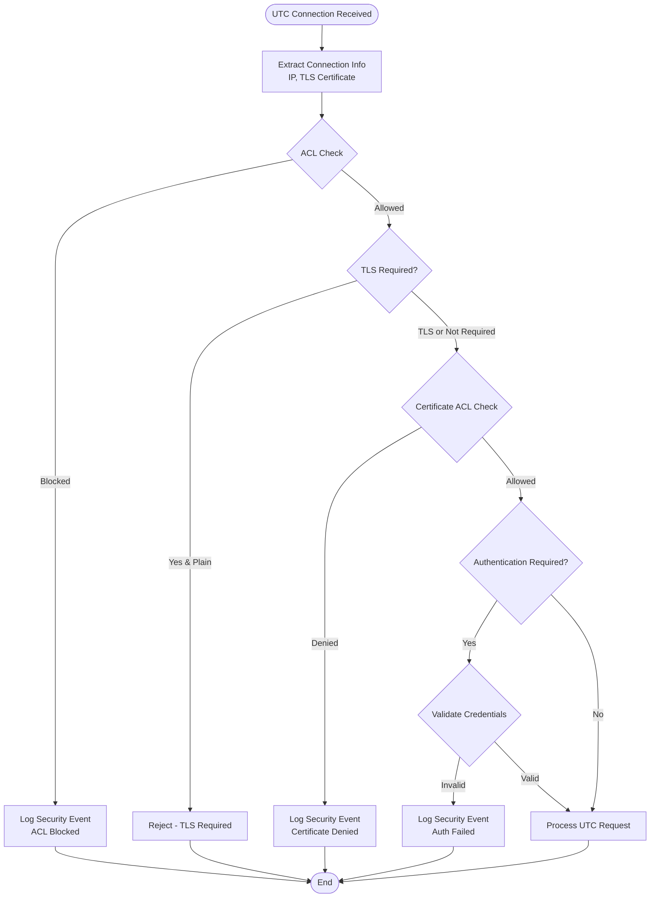

# Simple UTC Daemon - Security Diagrams

## Security Architecture

```mermaid
graph TB
    subgraph "Network Security"
        Firewall[Firewall<br/>UTC Ports]
        DDoSProtection[DDoS Protection<br/>Rate Limiting]
    end

    subgraph "Transport Security"
        TLS[TLS/SSL<br/>Encrypted Connections]
        Certificate[Certificate Management<br/>SSL/TLS Certs]
    end

    subgraph "Access Control"
        ACL[Access Control Lists<br/>IP/Network Based]
        CertACL[Certificate ACL<br/>TLS Certificate Control]
        Auth[Authentication<br/>User/Password]
    end

    Firewall --> TLS
    DDoSProtection --> ACL

    TLS --> Certificate
    Certificate --> CertACL

    ACL --> Auth
    CertACL --> Auth
```

## Security Flow

```mermaid
flowchart TD
    Start([UTC Connection Received]) --> ExtractInfo[Extract Connection Info<br/>IP, TLS Certificate]

    ExtractInfo --> ACLCheck{ACL Check}
    ACLCheck -->|Blocked| LogBlock1[Log Security Event<br/>ACL Blocked]
    ACLCheck -->|Allowed| TLSCheck

    TLSCheck{TLS Required?}
    TLSCheck -->|Yes & Plain| RejectTLS[Reject - TLS Required]
    TLSCheck -->|TLS or Not Required| CertCheck

    CertCheck{Certificate ACL Check}
    CertCheck -->|Denied| LogBlock2[Log Security Event<br/>Certificate Denied]
    CertCheck -->|Allowed| AuthCheck

    AuthCheck{Authentication Required?}
    AuthCheck -->|Yes| ValidateAuth{Validate Credentials}
    AuthCheck -->|No| ProcessRequest

    ValidateAuth -->|Invalid| LogBlock3[Log Security Event<br/>Auth Failed]
    ValidateAuth -->|Valid| ProcessRequest

    ProcessRequest[Process UTC Request] --> End([End])

    LogBlock1 --> End
    LogBlock2 --> End
    LogBlock3 --> End
    RejectTLS --> End
```
